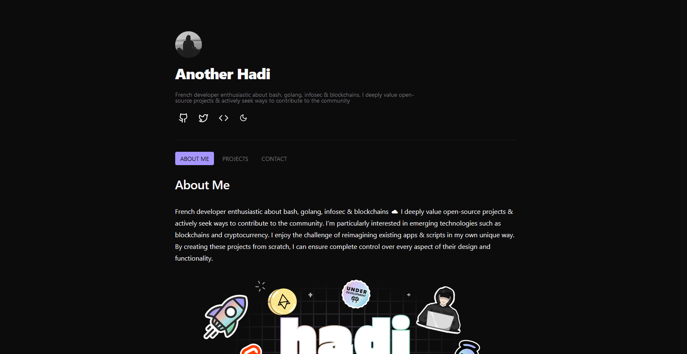

<div align="center">
    
</div>

<br>

# Portfolio

<br>
<div align="center">
    <a href="https://github.com/anotherhadi/portfolio">
        
    </a>
    <a href="https://github.com/anotherhadi/portfolio/stargazers">
        
    </a>
    <a href="https://github.com/anotherhadi/portfolio/">
        
    </a>
    <a href="https://github.com/anotherhadi/portfolio/blob/main/LICENSE">
        
    </a>
</div>
<br>

Url/Demo: [anotherhadi.com](https://anotherhadi.com)

My portfolio is a static site built with SvelteKit and TailwindCSS. It showcases my projects, blog posts and more.

## Screenshot:



## Installation:

### Npm

```bash
git clone https://github.com/anotherhadi/portfolio
cd portfolio
npm install
npm run build
```

The website content is on the `build` folder

### Nix

Todo